# Building a Constraint Runtime, Not Just a Solver

A solver answers one narrow question. A runtime has to support the whole decision loop.

## The operating surface

Navokoj accepts models from applications, chooses an execution path, respects a deadline, keeps the best-known state, repairs residual conflicts where possible, verifies the returned assignment, and records what happened. Billing and deployment are part of the same product because compute is an operating cost, not an afterthought.

This architecture lets customers start with a small interactive request and grow into large weighted, finite-domain, or streaming workloads without rebuilding their integration.

## The company direction

ShunyaBar Labs is building the infrastructure for expensive decisions: workforce scheduling, logistics, configuration, verification, policy enforcement, cloud placement, and agent planning.

The mathematics matters because it creates new operating regions. The product matters because customers need those regions expressed as a reliable contract: submit constraints, receive the best verified decision available before the deadline, and understand the result afterward.

## The runtime pipeline

```mermaid
flowchart LR
    Request[Authenticated model] --> Normalize[Validate and normalize]
    Normalize --> Admit[Quota and policy admission]
    Admit --> Route[Workload and hardware routing]
    Route --> Execute[Engine execution]
    Execute --> Repair[Hard-feasible repair]
    Repair --> Verify[Assignment verification]
    Verify --> Respond[Typed result]
    Respond --> Ledger[Usage and evidence records]
```



Each stage owns a different form of correctness.

| Stage | Responsibility | Failure it prevents |
| --- | --- | --- |
| Authentication | Identify the caller without exposing raw API keys | Unauthorized execution and credential leakage |
| Validation | Check dimensions, literals, masks, weights, and workload limits | Ambiguous or malformed models reaching a solver |
| Admission | Apply account, offering, concurrency, and hardware policy | Unbounded cost and cross-tenant resource exhaustion |
| Routing | Select an engine and an eligible execution environment | Sending an unsupported workload to the wrong path |
| Execution | Produce the best assignment available under engine controls | Treating orchestration as solving |
| Repair | Move a candidate into the hard-feasible region where possible | Returning a high-scoring but operationally invalid plan |
| Verification | Re-evaluate the returned assignment against the submitted model | Trusting a parser or solver status without checking the witness |
| Settlement | Reconcile actual execution, quota, and billing context | Charging for hardware that was not used |

A solver can be mathematically interesting while still being an incomplete runtime component. It does not authenticate a caller, preserve request semantics across execution paths, reconcile actual resource use, or tell an application whether a partial assignment is safe to execute.

## One request, several contracts

Consider a weighted scheduling request. At the API boundary it contains variables, clauses, weights, an explicit `hard_clause_mask`, an engine selector, and a requested budget.

That one request creates several simultaneous contracts:

1. **Model contract:** the clause and variable indices mean the same thing before and after routing.
2. **Hardness contract:** mandatory rules stay mandatory in every engine representation.
3. **Time contract:** the runtime reports how the selected engine interpreted the requested budget.
4. **Hardware contract:** the response and charge reflect the execution environment actually used.
5. **Result contract:** `solved`, `feasible`, and `partial` remain distinct states.
6. **Evidence contract:** the assignment can be checked against the original model.

The runtime exists to preserve those contracts while implementations change underneath it.

## Engine routing is semantic, not cosmetic

Different workloads expose different useful structures. Boolean CNF, weighted CNF, XOR chains, quantified formulas, finite-domain constraints, and schedules should not be forced through one accidental representation merely to simplify the API server.

Navokoj's stable external selectors let the runtime evolve engine implementations without requiring customers to rebuild their integration. Routing can consider:

- workload family and dimensions;
- clause density and weight structure;
- native XOR or finite-domain content;
- account entitlement and requested hardware;
- model size, concurrency, and current capacity;
- whether a local CPU path or remote worker is appropriate.

The selected engine and hardware class are returned as part of the result. Resource attribution must always reflect the path that actually completed the request. Routing is therefore part of both semantic and financial correctness.

## The result is a state machine

A runtime response should not collapse every outcome into one Boolean.

```text
SOLVED
  Every submitted clause is satisfied.

FEASIBLE
  Every explicit hard clause is satisfied; soft preferences may remain.

PARTIAL
  A candidate assignment exists, but mandatory violations remain.

ERROR
  The request could not be admitted, routed, executed, or interpreted.
```

An application can execute a `FEASIBLE` schedule while displaying its preference compromises. It must not execute a `PARTIAL` schedule merely because its aggregate satisfaction rate is high.

## Why billing belongs in the architecture

CPU, L4, H100, shared capacity, and dedicated deployments have different cost structures. Usage accounting cannot be bolted on after routing because the bill depends on what actually happened:

- which hardware accepted the job;
- whether execution fell back;
- how long the billable worker ran;
- whether the request failed before solving;
- which subscription or wallet funded it.

The response, engine trace, and ledger should agree. A mathematically valid assignment paired with stale hardware attribution is still a defective runtime result.

## Why deployment belongs too

The same decision contract must survive across hosted, private-network, on-premise, and disconnected environments. The surrounding infrastructure changes; the model and result semantics should not.

That requires versioned engines, explicit configuration, health checks, signed release identities, reproducible smoke tests, and upgrade/rollback procedures. A runtime is durable when a customer can operate the decision loop—not only call a binary once.

## The architectural invariant

Every layer should preserve one invariant:

> The result presented to the caller must describe the model that was submitted, the execution that actually occurred, and the assignment that was actually checked.

That invariant is the difference between a fast solver response and an operable constraint runtime.
