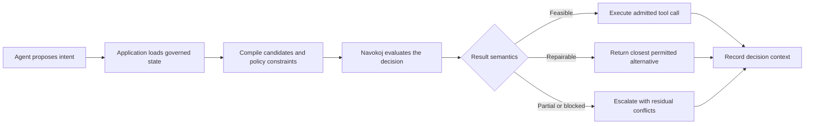

# Constraint Intelligence for AI Agents

An agent can decide what it wants to do. An operational system still needs to decide whether that action fits policy, capacity, permissions, timing, and dependencies.

Navokoj sits at that boundary.

## The control loop

An agent proposes an action. The application turns the proposal and the current state into a constraint model. Navokoj evaluates admissibility, identifies conflicts, and returns either an executable assignment or a structured reason to revise the proposal.

This is more useful than a binary guardrail when the world is constrained but not completely impossible. The runtime can preserve mandatory rules while suggesting the closest workable alternative for the preferences that no longer fit.

## Where it helps

The pattern applies to deployment changes, refunds, access requests, cloud placement, procurement, and scheduling. The agent remains responsible for intent. The constraint runtime makes the operational boundary explicit.

The result is not “the model said yes.” It is a decision record with the input, deadline, outcome, residual conflicts, and verification metadata.

## A concrete tool-call example

Consider a customer-support agent that proposes the following action:

```json
{
  "tool": "issue_refund",
  "customer_id": "cust_42",
  "transaction_id": "txn_771",
  "amount_usd": 480,
  "reason": "service_failure"
}
```

The proposal is syntactically valid. That does not make it operationally admissible. The application may need to enforce all of the following at once:

- the customer owns the transaction;
- the refund cannot exceed the captured amount;
- refunds above $250 require manager approval;
- fraud-flagged accounts require manual review;
- the team's monthly refund budget cannot be exceeded;
- an eligible service failure should be resolved without unnecessary delay.

The first five are organizational state and policy. The final rule is a preference. Prompting the model to “remember the refund policy” places all six rules inside probabilistic generation. A constraint boundary makes them explicit inputs to a separate decision.

## From intent to a constraint model

The application—not the language model—translates the proposed action and current state into candidate outcomes. For this example, those outcomes might be:

| Decision variable | Meaning |
| --- | --- |
| `x1` | Approve the requested $480 refund now |
| `x2` | Issue the permitted $250 refund now |
| `x3` | Request manager approval for the remaining amount |
| `x4` | Route the complete request to manual review |

The model then expresses relationships between those choices:

- at least one outcome must be selected;
- mutually exclusive outcomes cannot be selected together;
- `x1` requires a valid manager-approval state;
- a fraud flag requires `x4`;
- `x2 + x3` is preferred to a full manual handoff when policy allows it;
- preserving more of the requested refund carries greater soft value.

For Boolean workloads, the compiled request can use the ordinary `/v1/solve` contract:

```json
{
  "num_vars": 4,
  "clauses": [
    [1, 2, 4],
    [-1, -2],
    [-1, -4],
    [-2, -4],
    [-1, 3],
    [2],
    [3]
  ],
  "weights": [1000, 1000, 1000, 1000, 1000, 8, 3],
  "hard_clause_mask": [true, true, true, true, true, false, false],
  "engine": "nitro",
  "timeout_budget_seconds": 0.5
}
```

This illustrative encoding is intentionally small. Production policy compilers normally generate the clauses from typed rules rather than asking application developers to maintain literal arrays by hand. The important contract is explicit: `hard_clause_mask` defines which rules are mandatory, while weights rank the preferences inside the admissible region.

## The decision loop



The language model is responsible for proposing intent and explaining alternatives. The application remains responsible for loading authoritative state, compiling policy, authenticating the caller, and deciding which result states are executable. Navokoj is responsible for evaluating the resulting constrained decision.

## Five outcomes an application can distinguish

| Outcome | Meaning | Application behavior |
| --- | --- | --- |
| Original action admitted | The proposed action satisfies every hard rule | Execute the requested tool call |
| Repaired alternative | A different assignment satisfies every hard rule | Present or execute the permitted alternative |
| Hard-feasible with soft cost | Mandatory policy holds, but preferences conflict | Execute and record the compromises |
| Partial | Some mandatory constraints remain violated | Do not execute; retry, revise, or escalate |
| Error | The request itself could not be evaluated | Fail closed at the application boundary |

`feasible` is the critical execution flag. A high overall satisfaction rate does not authorize a tool call if even one mandatory policy remains violated.

## Repair without granting new authority

A repaired assignment must remain inside the authority already represented by the model. Navokoj can select a permitted $250 refund and request approval for the remainder because both are explicit candidates. It must not invent a new capability, create an approval, or treat a soft preference as permission.

This is why constraint intelligence complements rather than replaces identity systems, policy stores, approval services, and human review. The runtime can search the space of admissible combinations; the organization defines that space.

## What belongs in the decision record

For a consequential agent action, retain enough context to reconstruct the decision:

- the normalized proposal;
- the policy and state snapshot identifiers;
- the compiled model or its content hash;
- the requested deadline and selected engine;
- the returned assignment and feasibility state;
- residual violations and variable blame;
- the final executed action, if any;
- the human approval or override, when applicable.

This produces a stronger operational statement than “the model decided to issue a refund.” It records which action was proposed, which rules governed it, which alternative was admitted, and why execution proceeded.

## Where the pattern applies

The same boundary can govern:

- deployment agents choosing regions, rollout modes, and rollback paths;
- procurement agents operating under supplier, budget, and approval constraints;
- access agents composing roles and temporary grants;
- cloud agents placing workloads under capacity and affinity rules;
- scheduling agents balancing coverage, labor rules, and preferences;
- support agents selecting refunds, credits, escalations, and follow-up actions.

The domain changes. The separation remains stable: probabilistic intent on one side, explicit operational admissibility on the other.
