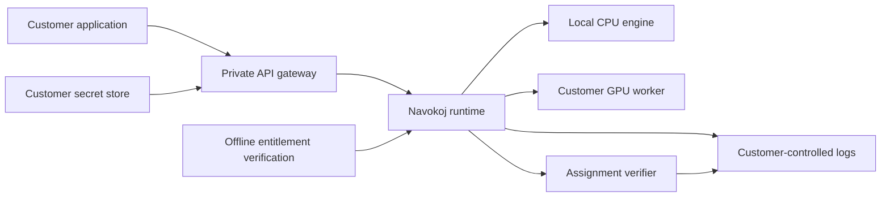

# Deploying Navokoj in Private and Air-Gapped Environments

Some constraint workloads cannot leave the customer's network. Scheduling data, hardware designs, policies, and infrastructure topology may be too sensitive for a public service.

Navokoj supports a deployment conversation that starts with data boundaries rather than forcing every customer into the same hosting model.

## The deployment choices

Teams can evaluate hosted API execution, private networking, or an on-premise and air-gapped package depending on the workload and governance requirements. The important properties remain the same: explicit resource budgets, inspectable results, controlled credentials, and reproducible execution metadata.

Private deployments separate the solver workload from the public product surface. Credentials, logs, artifacts, and update packages can be managed inside the customer's controls. Air-gapped updates are delivered as signed, versioned packages rather than requiring a runtime phone-home path.

## What an evaluation covers

An enterprise evaluation should define the model boundary, required hardware, expected throughput, verification process, update path, and operational owner. That creates a deployment plan grounded in the customer's actual constraints instead of a generic infrastructure diagram.

## Reference topology

The important boundary is ownership. The customer controls ingress, credentials, runtime logs, model artifacts, execution hardware, and release acceptance. The solver does not need the public product database to interpret a model or verify an assignment.

## Three deployment profiles

| Profile | Data path | Appropriate when |
| --- | --- | --- |
| Hosted API | Model is submitted to the managed Navokoj service | Evaluation and ordinary workloads can use shared infrastructure |
| Private network | Runtime is isolated behind customer networking or dedicated capacity | Data may use managed infrastructure but must not cross a public endpoint |
| On-premise / air-gapped | Images, licenses, logs, and execution stay inside the customer environment | No runtime network path to ShunyaBar Labs is permitted |

The deployment profile should follow the data classification and operational requirements, not the size of the sales contract.

## The release bundle

A disconnected release is more than a container tarball. The delivery procedure is designed around an immutable image digest and a bundle containing:

- the OCI image or customer-registry import instructions;
- a signed release manifest tied to the exact digest;
- an SPDX or CycloneDX software bill of materials;
- a vulnerability scan report and acceptance policy;
- Cosign signature and verification material;
- the offline license payload;
- deployment configuration and resource requirements;
- health, CNF, and WCNF smoke tests;
- installation, upgrade, and rollback instructions.

The signing private key is never part of the customer bundle. The customer verifies the release before admitting it into the internal registry.

## Offline licensing

The private runtime verifies entitlement locally rather than requiring the solver to contact a public licensing endpoint.

The signed license payload can bind fields such as:

- license and customer identity;
- plan and enabled features;
- permitted engines or deployment profile;
- validity period;
- optional capacity limits.

The deployment verifies the signed entitlement using public verification material before accepting work. The vendor's signing capability is never present inside the customer environment. The precise component and storage topology is release-specific and documented only in the private deployment runbook.

An air-gapped profile must remain meaningful when outbound DNS, HTTP, telemetry, and public package registries are unavailable.

## Network and process boundaries

The hardened profile should enforce:

- non-root runtime processes;
- read-only root filesystems where practical;
- read-only secret mounts where applicable;
- narrowly scoped writable storage;
- default-deny network policy;
- no outbound egress for solver and license containers;
- customer-controlled ingress and TLS termination;
- logs written only to approved local sinks;
- resource limits appropriate to the selected engine.

“No phone home” should be a property that the customer can test by denying egress, not a promise that depends on trust.

## Installation and acceptance

A private deployment is accepted only after the customer can reproduce the operating checks:

1. verify the image signature and release manifest;
2. inspect the SBOM and vulnerability report;
3. import the image by digest into the internal registry;
4. install the entitlement material and start the runtime;
5. confirm `/health` reflects valid and invalid license states correctly;
6. run known CNF and WCNF smoke tests;
7. verify returned assignments independently;
8. confirm runtime egress is denied;
9. record the accepted digest and configuration.

This turns delivery into a customer-owned release record rather than an opaque binary handoff.

## Upgrade and rollback

Disconnected updates should be installed beside the currently accepted digest. Traffic changes only after the new version passes the same signature, health, and solve checks.

Rollback restores the previously accepted digest and configuration without downloading anything or requesting a new online authorization. The customer should retain both release records so an incident review can identify exactly which engine and policy bundle produced a decision.

## Capacity planning

Private deployment sizing begins with the workload, not a generic GPU recommendation:

- Boolean versus weighted, XOR, finite-domain, or scheduling models;
- typical and maximum variables and constraints;
- request concurrency and arrival bursts;
- interactive versus batch deadlines;
- expected hard-feasibility and quality requirements;
- CPU-only versus GPU-eligible engines;
- artifact, log, and retention volume.

A representative workload pack should be run on candidate hardware before the final topology is selected. Solver time, end-to-end latency, memory high-water mark, throughput, and result quality are all capacity inputs.

## Evaluation output

A serious deployment evaluation should end with concrete artifacts:

| Output | Question answered |
| --- | --- |
| Data-flow diagram | Where can customer models and assignments travel? |
| Threat model | Which boundaries and failure modes are being defended? |
| Capacity report | What hardware supports the expected workload? |
| Release checklist | How is a specific image admitted? |
| Verification procedure | How does the customer check returned assignments? |
| Upgrade/rollback drill | Can the system change safely without internet access? |
| Operational ownership matrix | Who responds when a component becomes unhealthy? |

Private deployment is successful when the customer can operate, inspect, upgrade, and recover the runtime inside its own controls.
