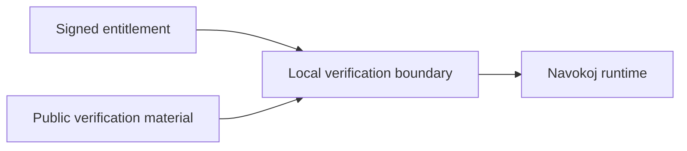

# The Seven Trust Boundaries of a Private Navokoj Deployment

Enterprise security is not produced by hiding a binary or naming a collection of tools. It comes from explicit trust boundaries, inspectable release identity, least privilege, and a recovery procedure that still works when a component fails.

Navokoj's private-delivery architecture is organized around seven boundaries. Each one answers a different question:

1. Where does source and build intent originate?
2. How is the producer's identity attached to a release?
3. What may enter the customer environment?
4. How is runtime entitlement checked without a public dependency?
5. What can each process read, write, and execute?
6. Where can customer models and telemetry travel?
7. How does the customer upgrade, recover, and audit the system?

No individual control is sufficient. The security property comes from their composition.

## Boundary 1: Source and build provenance

The source-of-truth repository and release build system define what is eligible to become a customer artifact. Access control, encrypted developer transport, reviewed changes, reproducible build inputs, and clean-tree release procedures protect this boundary.

The useful output is not “the source is private.” It is a traceable relationship:

```text
reviewed source revision
    → build inputs
        → container image
            → immutable digest
```

That relationship allows a release manifest to name the repository revision, engine versions, build time, included packages, and resulting digest without exposing customer data or signing secrets.

## Boundary 2: Release identity and signatures

The release digest is signed with a vendor-held key. The customer receives verification material, never the private signing key.

A release bundle should carry:

- the immutable image digest;
- a signed release manifest;
- a Cosign signature and verification instructions;
- provenance or attestation describing the build;
- an SBOM;
- a vulnerability scan report.

The signature answers “did the expected producer authorize this exact digest?” It does not claim that the image contains no vulnerabilities. SBOM review, scanning, configuration review, and customer acceptance remain separate controls.

## Boundary 3: Registry admission

The customer-controlled registry is the gate between delivered material and runnable infrastructure.

An admission policy can reject:

- unsigned images;
- tags that do not resolve to the accepted digest;
- releases without the required SBOM or scan report;
- images above the customer's vulnerability threshold;
- configurations that request prohibited privileges.

Production deployment should reference digests rather than mutable tags. A name such as `navokoj:latest` is convenient for humans but insufficient as an audit identity.

## Boundary 4: Offline licensing

Air-gapped operation cannot depend on a public license request. Navokoj therefore performs entitlement verification locally.

The customer supplies signed entitlement material through an approved secret path. The runtime verifies it using public verification material before admitting work; vendor signing authority is never included in the deployment.



The signed payload can bind customer identity, enabled features, deployment profile, capacity, and expiration. Modifying a signed field invalidates the signature. The deployed runtime has no capability to issue itself a new valid license.

The verification boundary must fail in a visible, testable way when entitlement is missing, malformed, expired, or signed by an unknown key. Its internal component and storage topology is part of the private deployment runbook rather than the public security model.

## Boundary 5: Runtime hardening

The API, license verifier, and solver processes should receive only the capabilities they require.

The hardened profile includes:

- non-root execution;
- read-only root filesystems where compatible;
- narrowly scoped writable volumes;
- dropped Linux capabilities;
- resource limits;
- secret mounts separated from ordinary configuration;
- health checks that expose component state without leaking secrets;
- no raw API keys in logs;
- compiled or stripped production artifacts where source distribution is not part of the contract.

Native compilation and stripped LuaJIT bytecode can raise the cost of casual reverse engineering. They are defense-in-depth measures, not substitutes for access control, signing, process isolation, or contractual protection.

## Boundary 6: Network and data isolation

The customer defines where models, assignments, logs, and artifacts may travel.

For the disconnected profile:

- solver and license containers have no outbound egress;
- DNS and public HTTP are unavailable;
- ingress passes through customer-controlled authentication and TLS;
- logs remain in customer-approved sinks;
- model artifacts are written only to configured local storage;
- telemetry is disabled or directed to customer-owned infrastructure.

The strongest demonstration is an egress-denial test. “The runtime does not phone home” should remain true when every outbound destination is blocked.

Privacy-oriented domain registration or encrypted communication channels may reduce unrelated exposure during development and delivery. They do not replace application security controls and are not part of the customer's runtime trust decision.

## Boundary 7: Operational continuity

A secure system that cannot be upgraded or recovered safely is not production-ready.

Every accepted release should have:

- installation and health-check instructions;
- representative CNF and WCNF smoke tests;
- expected verification output;
- an upgrade procedure that installs beside the current digest;
- rollback to the last accepted digest without internet access;
- a record of the license, configuration, engine, and image used;
- named owners for API, license, registry, and solver incidents.

Rollback is itself a security control. It limits the duration of a defective or compromised release while preserving evidence about what changed.

## Threat-to-control map

| Threat | Primary controls |
| --- | --- |
| Unauthorized release substitution | Digest pinning, signed manifest, registry admission |
| Dependency vulnerability | SBOM, vulnerability scan, customer acceptance policy |
| Modified or forged license | Asymmetric signature verification, read-only secret mount |
| Runtime privilege escalation | Non-root execution, dropped capabilities, read-only filesystem |
| Model or assignment exfiltration | Default-deny egress, customer logging, local artifact storage |
| Credential disclosure | Secret mounts, masked logging, scoped API identity |
| Bad upgrade | Side-by-side installation, smoke tests, recorded rollback |
| Ambiguous incident history | Immutable digests, release records, local audit logs |

## Customer acceptance procedure

Before switching production traffic, the customer should be able to perform the following without vendor-only access:

1. verify the release signature;
2. match the image to the signed digest;
3. inspect the SBOM and scan report;
4. confirm local entitlement verification accepts valid material and rejects invalid material;
5. run known solve and verification fixtures;
6. confirm outbound network access is denied;
7. inspect runtime logs for secret leakage;
8. exercise an upgrade and rollback;
9. record the accepted release identity.

The result is a customer-controlled evidence chain from delivered artifact to running decision service.

## What this architecture does not claim

Navokoj does not claim a “zero attack surface.” Every API, parser, container runtime, registry, and operating system introduces one.

The architecture also does not claim that software is impossible to inspect, track, intercept, or reverse engineer. Absolute language hides the work security teams actually need to evaluate.

The defensible claim is narrower and stronger:

> A private Navokoj deployment can be delivered as a signed, inspectable, least-privilege, offline-operable release whose network behavior, license state, execution identity, and rollback path remain under customer control.

That is the purpose of the seven boundaries.
